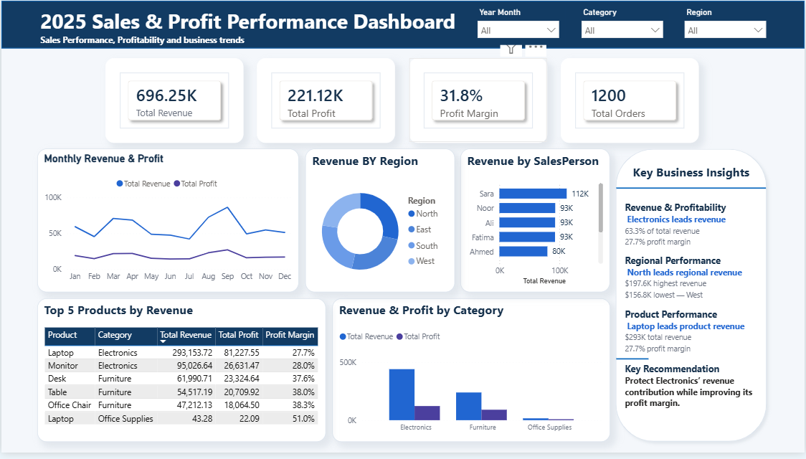

# 📊 Sales Analytics Dashboard

## 📌 Project Overview

An interactive Power BI dashboard designed to analyze sales performance, revenue, profitability, and business trends.

The dashboard provides an executive-level view of key sales metrics and helps identify high-performing products, categories, regions, and salespeople.

---

## 🎯 Business Objective

The main objective of this project is to transform raw sales data into meaningful business insights that support data-driven decision making.

The analysis focuses on:

- Revenue performance
- Profitability
- Profit margin
- Monthly sales trends
- Regional performance
- Category performance
- Product performance
- Salesperson performance

---

## 🛠️ Tools & Technologies

- *Power BI*
- *Power Query*
- *DAX*
- *Microsoft Excel*
- *Data Visualization*

---

## 📊 Dashboard Features

### Key Performance Indicators

- Total Revenue
- Total Orders
- Total Profit
- Profit Margin %

### Sales Analysis

- Monthly Revenue & Profit
- Revenue by Region
- Revenue & Profit by Category
- Revenue by Salesperson
- Top 5 Products by Revenue

### Business Insights

The dashboard highlights key findings related to:

- Revenue contribution by category
- Regional sales performance
- Top-performing products
- Product profitability
- Business recommendations

---

## 🔄 Data Preparation

The dataset was prepared and transformed before visualization.

The process included:

1. Data quality assessment
2. Data cleaning
3. Handling missing values
4. Data type transformation
5. Creating calculated fields
6. Revenue and profitability calculations
7. Data modeling
8. DAX measures
9. Dashboard development

---

## 📈 Key Insights

The analysis identified several important business patterns, including:

- Electronics is the leading revenue-generating category.
- North is the highest-performing region by revenue.
- Laptop is the highest-revenue product.
- Profitability varies across products and categories.
- Monthly analysis reveals changes in revenue and profit performance.

---

## 📷 Dashboard Preview



---

## 👩‍💻 Author

*Bushra*

Data Analytics | Power BI | SQL | Excel | Business Intelligence

---

## 📁 Project Structure

```text
Sales-analytics-dashboard/
│
├── README.md
├── dashboard.png
└── Sales-Analytics-Dashboard.pbix
